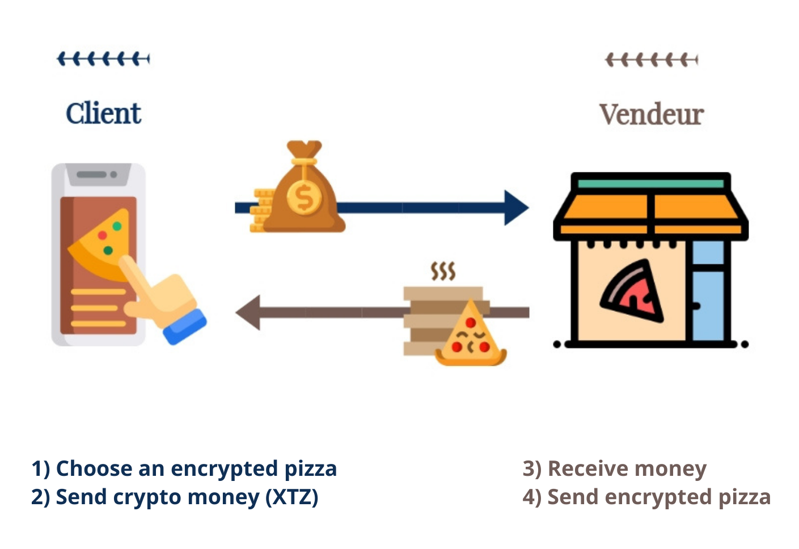

# ProductDeliveryProtocol

Product Delivery Protocol is a network protocol that simulates a blockchain smart contrat. A client can purchase products using their crypto money.

  

The program is written in OCaml language and the protocol is carried out through network communication using TCP/IP.

The Sodium library is used for the signatures and encryptions.

# Architecture

## Server

- **PDP_server.ml**:
    - Introduce the program 
    - Establish connexion with 5 possible clients at the same time.
    - Send welcome message
    - Signature with Sodium library

- **data_managment.ml**:
    - Encryption of data using Sodium library
    - Send encrypted product

- **product.ml**:
    - Product class: price, name, description, data, data crypted, contract address, secret key and public key.
    - Product methods
    - Generate product 
    - Process user requests
        - Send product name
        - Send product data
        - Send product description
        - Send product price
        - Send product contract address 

- **client.ml**:
    - Client class: name, address, signed proof
    - Client methods
    - Send an offer for a product 

## Client

- **PDP_client.ml**:
    - Establish connexion with the server
    - Retry establishment of connexion if failed
    - Retrieve products names availables on the server
    - Asks if user want to procede with the purchase
    - Send refusal of offer to server

- **PDP_purchase.ml**:
    - Product to purchase class and its methods 
    - Blockchain Tezos informations and methods
        - Client signature
        - Client address
        - Server signature
        - Contract address
        - Client name 
    - Procede with the purchase steps
        - Send request for specific product
        - Send money 
        - Decrypt the product

- **PDP_conversion.ml**:
    - conversion between strings, hex, string to word array... 
   
